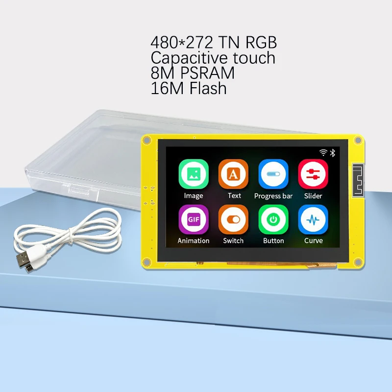
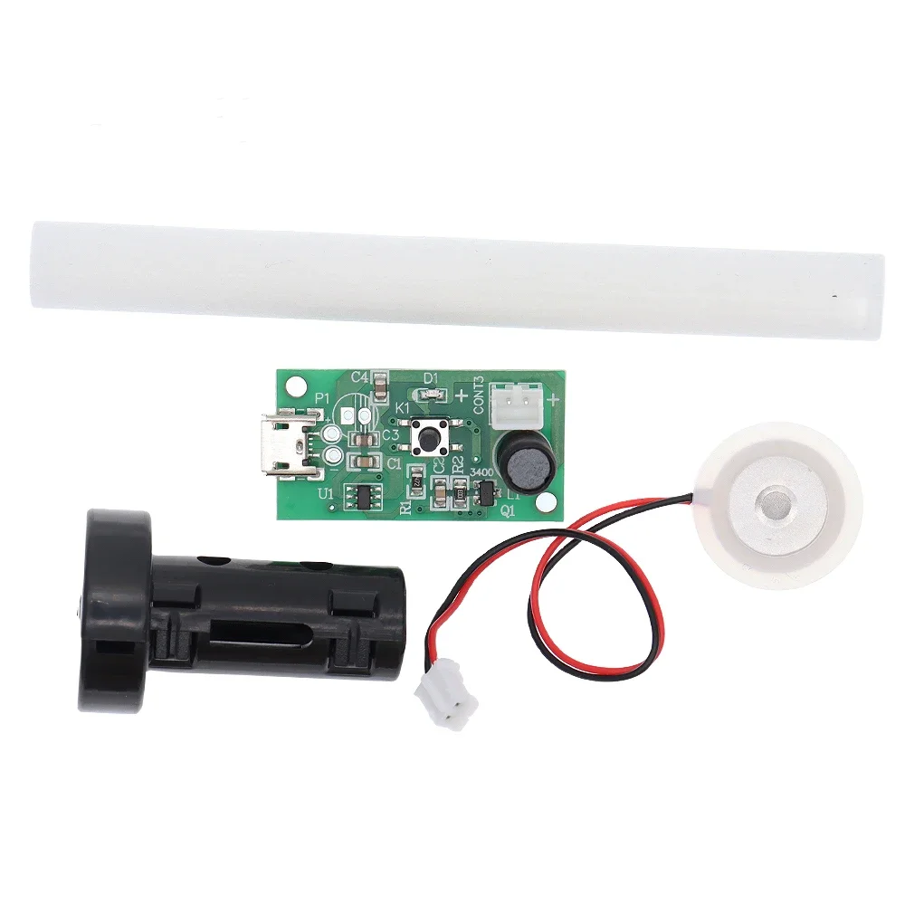
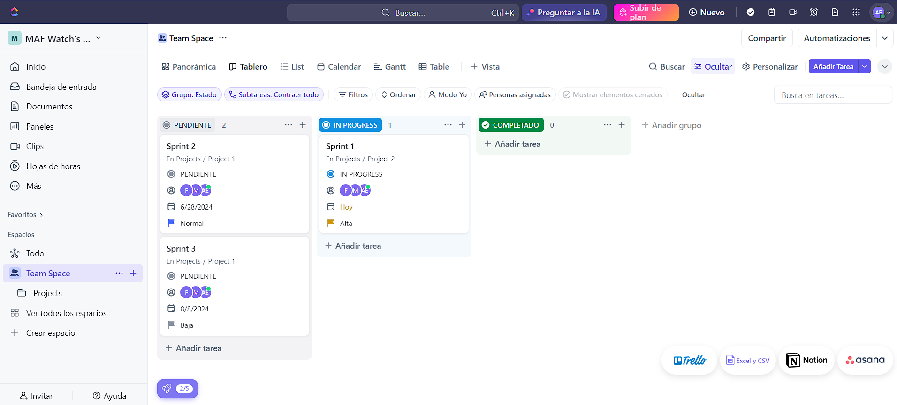
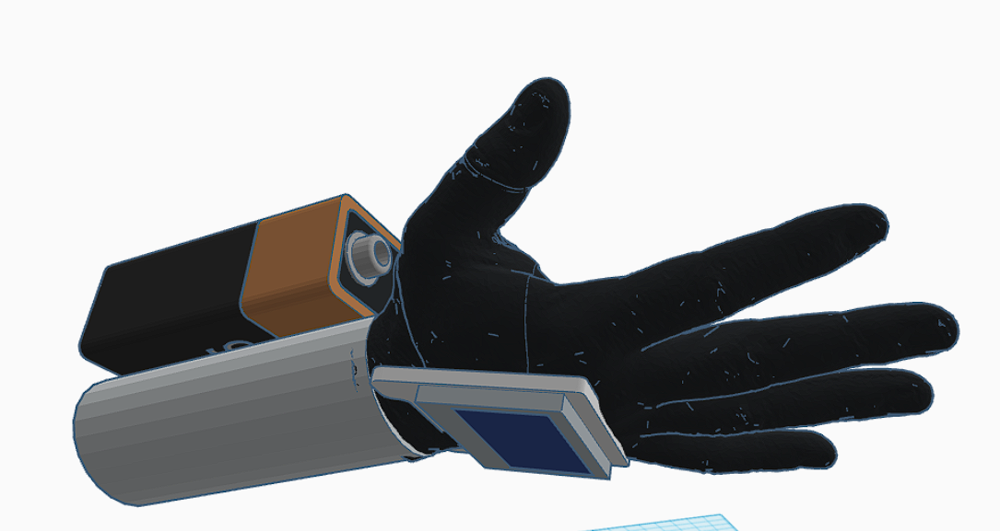
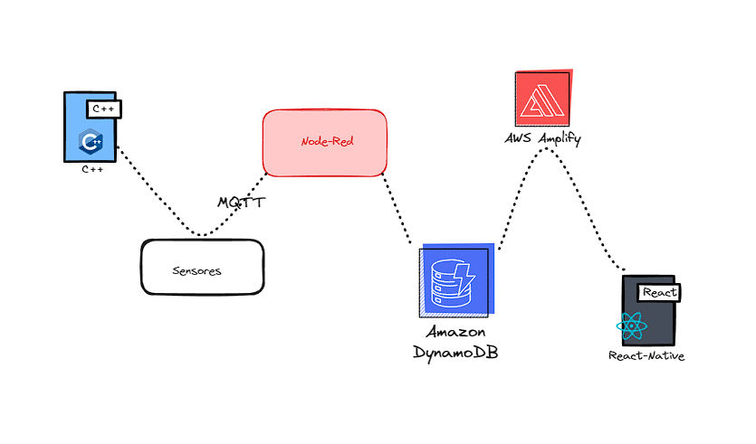
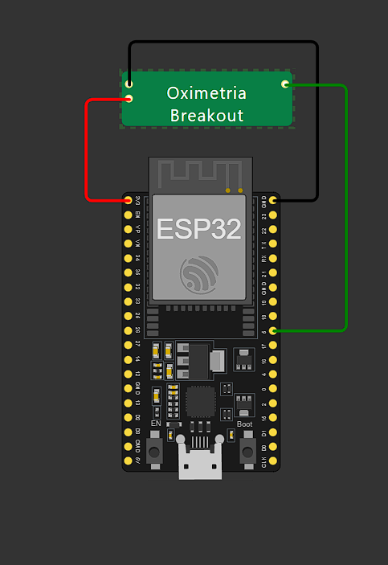
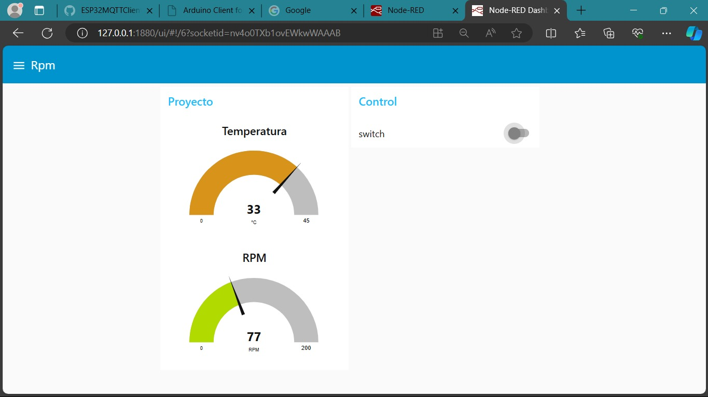

## MAF-Watch
Proyecto de Dispositivo Inteligente.

## Integrantes.
- Abraham Salvador Espinoza Gómez.
- Mario Alberto Rangel Márquez.
- Fernando Arvizu Sotelo.

## Visión del proyecto.

 La visión de este producto consiste en brindar para las personas que desean mejorar la calidad de su ambiente de descanso y monitorear su salud en tiempo real, nuestro dispositivo inteligente de monitoreo de ambiente y salud ofrece una solución perfecta. Este sistema integrado de sensores mide luz, temperatura y ritmo cardiaco, y activa automáticamente mecanismos para optimizar el entorno. A diferencia de otros dispositivos que solo monitorean una o dos condiciones ambientales sin capacidad de intervención automática, nuestro producto no solo realiza un monitoreo exhaustivo de múltiples parámetros ambientales y de salud en tiempo real, sino que también toma medidas proactivas para mejorar activamente la calidad del sueño del usuario, asegurando un descanso verdaderamente reparador y una salud óptima.

## Objetivo general.

 Desarrollar un reloj inteligente equipado con tecnología avanzada para el monitoreo y análisis en tiempo real de las condiciones ambientales y vitales del usuario. Este dispositivo incluirá funcionalidades personalizables, como mini humidificadores integrados para refrescar y aplicar lociones según las necesidades del usuario. Mediante el uso de sensores para la luz, temperatura, ruido y ritmo cardíaco, el reloj ajustará automáticamente la iluminación, la aplicación de lociones y otros mecanismos, como la protección UV, para mejorar el bienestar y la salud del usuario en cualquier ambiente.

### Objetivos específicos.
1. 
 Diseñar y desarrollar un sistema integrado de sensores para medir con precisión la luz ambiental, temperatura, niveles de ruido, y ritmo cardíaco, proporcionando una base de datos confiable para el análisis del bienestar del usuario.

2. 
 Implementar funcionalidades automáticas de confort ambiental utilizando mini humidificadores integrados en el reloj para aplicar agua y lociones personalizadas. Esto se activará según los parámetros ambientales detectados o preferencias preestablecidas del usuario, mejorando su experiencia en diferentes condiciones.

3. 
 Desarrollar un algoritmo de respuesta inteligente que analice los datos recolectados por los sensores y active automáticamente mecanismos de protección, como filtros UV y ajustes de humedad, para mantener un entorno óptimo para la salud y confort del usuario.

4. 
 Crear una interfaz de usuario intuitiva en la pantalla táctil del reloj que permita a los usuarios visualizar y gestionar las mediciones en tiempo real, así como ajustar manualmente las configuraciones del dispositivo según sus necesidades personales.

## Tabla de Software utilizado.
| Id | Software | Versión | Tipo |
|----|----------|---------|------|
| 1 |  DynamoDb  | WEB | NoSQL |
| 2 | Arduino IDE  | 4.1.4 |  IDE |
| 3 | Node-Red | 3.2.9 | MQTT |
| 4 | AWS | web | Micro services |
| 5 |React-Native | 0.74.1 | framework | 

## Tabla con el hardware utilizado (El costo de cada componente es al día de 2-3 de junio del 2024).
| Id | Componente | Descripción | Imagen | Cantidad | Costo total |
|----|------------|-------------|--------|----------|-------------|
|1|TZT|TZT Módulo de Motor de vibración vibratoria de 5V, de alto y bajo nivel||1|$6,22 MXN|
|2|fotoconductora|Resistencia fotoconductora de luz LDR. ||1|$7,83 MXN|
|3|Sensor de detección UV|Módulo de Sensor de detección UV, módulo de rayos ultravioleta.||2|$43,32 MXN|
|4|Pantalla táctil|Pantalla táctil inteligente para Arduino LVGL, módulo TFT LCD RGB de 4,3 pulgadas.||1|$560,69 MXN|
|5|Mini humidificador USB|Mini humidificador USB, Kits de bricolaje, fabricante de niebla y controlador||2|$27,77 MXN|
|6|ESP32|ESP32 es la denominación de una familia de chips SoC de bajo coste y consumo de energía, con tecnología Wi-Fi y Bluetooth de modo dual integrada.||2|$250.00 MXN|
|7|Sensor de oximetría|Módulo de Sensor de oximetría de frecuencia cardíaca, Sensor de ritmo cardíaco, consumo de energía ultrabajo. ||1|$24,67|

## Épicas del proyecto (Mínimo debe de haber una épica por integrante del equipo).
- 
 Monitoreo y adaptación ambiental: Esta épica se centra en el uso continuo de sensores integrados para medir factores ambientales como luz UV, temperatura, ruido y humedad. Con base en esta información, el sistema aconsejará al usuario sobre las medidas de protección a tomar, como la aplicación de bloqueador solar o cambios en la configuración del ambiente. Además, activará automáticamente funciones como la protección contra rayos UV o la humidificación para mantener un entorno óptimo.

- 
 Gestión personalizada del confort: Esta épica aborda el ajuste automático de las condiciones del entorno personal del usuario mediante la activación de mini humidificadores para rociar agua o lociones específicas. El sistema utilizará algoritmos para determinar el momento óptimo para activar estos mecanismos basándose en los datos recopilados por los sensores y las preferencias personales del usuario, asegurando su confort y presentación en cualquier situación.

- 
 Análisis y síntesis de datos para bienestar personalizado: Se enfoca en el almacenamiento avanzado y análisis de los datos ambientales y vitales recolectados por los sensores del dispositivo. Esta épica implica desarrollar soluciones para procesar y analizar datos en tiempo real, almacenarlos de manera segura y proporcionar al usuario resúmenes y recomendaciones personalizadas a través de una aplicación o dashboard integrado. El objetivo es permitir al usuario entender mejor su entorno y sus propias respuestas fisiológicas para tomar decisiones informadas sobre su salud y bienestar.

## Tabla de historias de usuario.
| Id | Historia de usuario | Prioridad | Estimación | Como probarlo | Responsable |
|----|---------------------|-----------|------------|---------------|-------------|
|  1  | Como usuario, quiero que se monitorice en tiempo real la temperatura que tengo para tener información más fiel a la realidad. | 1 | 3 Días | Se obtiene información fiel en tiempo real a través del sensor. | Mario Alberto Rangel Márquez |            |
|  2  | Como usuario, quiero que se monitorice en tiempo real mi ritmo cardiaco que tengo para tener información más fiel a la realidad. | 1 | 3 Días | Se obtiene información fiel en tiempo real a través del sensor. | Abraham Salvador Espinoza Gómez |
|  3  | Como usuario, quiero que se monitorice en tiempo real la luz UV para saber si debo usar bloqueador solar | 1 | 3 Días | Se obtiene información fiel en tiempo real a través del sensor. | Mario Alberto Rangel Márquez |
|  4  | Como usuario, quiero poder rosearme aromas en ciertos momentos. | 5 | 3 Días | Se obtiene información fiel en tiempo real a través del sensor. | Mario Alberto Rangel Márquez. | 
|  5  | Como usuario, quiero poder configurar un recordatorio para dormir. | 5 | 3 Días | Se obtiene información fiel en tiempo real a través del sensor. | Mario Alberto Rangel Márquez |  
|  6  | Como usuario quiero saber la duración de mi sueño para saber si dormí las horas necesarias.| 2 | 3 Días | Se obtiene información fiel en tiempo real a través del sensor.| Fernando Arvizu Sotelo. | 
|  7  | Como usuario quiero que el dispositivo se acomodó de usar para que no me moleste al dormir.| 3 | 3 Días | Se obtiene información fiel en tiempo real a través del sensor. | Fernando Arvizu Sotelo. | 

## Tablero de Kanban.

## Prototipo en dibujo
Prototipo para diseño en 3D para imprecion. 

## Arquitectura.

## Circuito diseñado.

## Librerias Utilizadas.
- Wire.h
- MAX30105.h
- heartRate.h
- WiFi.h
- PubSubClient.h

## Dashboard de Node-Red.

## Resultado.

Los resultados obtenidos hasta el momento han sido satisfactorios. En los primeros tres requisitos, o en el primer Split, se han cumplido las expectativas previstas. Dentro de los primeros dos requisitos se cumplió la funcionalidad de alertar en caso de que el ritmo cardiaco no sea normal en el usuario.

