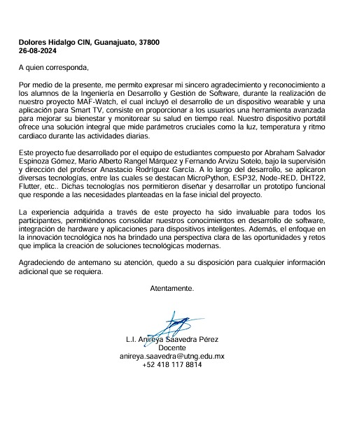

# MAF-Watch
Proyecto de Dispositivo Inteligente.

## Integrantes.
- Abraham Salvador Espinoza Gómez.
- Mario Alberto Rangel Márquez.
- Fernando Arvizu Sotelo.

## Visión del proyecto.

 La visión de este producto consiste en proporcionar a los usuarios una herramienta avanzada para mejorar su bienestar y monitorear su salud en tiempo real. Nuestro dispositivo portátil ofrece una solución integral que mide parámetros cruciales como la luz, temperatura y ritmo cardiaco durante las actividades diarias. A diferencia de otros dispositivos que solo monitorean uno o dos parámetros sin capacidad de intervención automática, nuestro producto no solo realiza un seguimiento exhaustivo de múltiples indicadores de salud y ambiente en tiempo real, sino que también toma medidas proactivas para optimizar las condiciones de bienestar del usuario. Con este wearable, aseguramos una supervisión continua y personalizada, ayudando a los usuarios a mantener una salud óptima y mejorar su calidad de vida.

## Objetivo general.

Desarrollar un dispositivo portátil equipado con tecnología avanzada para el monitoreo y análisis en tiempo real de las condiciones ambientales y vitales del usuario, ideal para cualquier persona, no solo para deportistas. Este wearable incluye sensores para medir la luz, temperatura, ruido y ritmo cardíaco. La información recolectada se muestra en una pantalla OLED e interactúa con una aplicación desarrollada en Flutter. El dispositivo ajusta automáticamente diversos parámetros, como la protección UV, para mejorar el bienestar y la salud del usuario en cualquier ambiente.

### Objetivos específicos.
1. 
Diseñar y desarrollar un sistema integrado de sensores para medir con precisión la luz ambiental, temperatura, niveles de ruido y ritmo cardíaco, proporcionando una base de datos confiable para el análisis del bienestar del usuario.

2. 
Implementar funcionalidades automáticas de confort ambiental ajustando la iluminación, aplicando mecanismos de protección UV y optimizando la temperatura según los parámetros ambientales detectados o preferencias preestablecidas del usuario, mejorando su experiencia en diferentes condiciones.

3. 
Desarrollar un algoritmo de respuesta inteligente que analice los datos recolectados por los sensores y active automáticamente mecanismos de protección y confort, como ajustes de iluminación y protección UV, para mantener un entorno óptimo para la salud y comodidad del usuario.

4. 
Crear una interfaz de usuario intuitiva en la pantalla OLED del dispositivo portátil y en una aplicación móvil desarrollada en Flutter, que permita a los usuarios visualizar y gestionar las mediciones en tiempo real, ajustar manualmente las configuraciones del dispositivo, controlar algunos de los sensores según sus necesidades, y manipular directamente la pantalla OLED para personalizar la visualización y las funciones del dispositivo.

## Tabla de Software utilizado.
| Id | Logos | Software | Versión | Tipo |
|----|--------|----------|---------|------|
| 1 |  | MariaDB | 11.6.2 | SQL |
| 2 |  | Thonny | 4.1.4 |  IDE |
| 3 |  | Node-Red  | 3.2.9 | MQTT |
| 4 |  | Mosquito | 2.0.18 | Controlador |
| 5 |  | Flutter  | 3.22.2 | framework |
| 6 |  | Firebase  | 12.1.0 | framework |

## Tabla con el hardware utilizado (El costo de cada componente es al día de 2-3 de junio del 2024).
| Id | Componente | Descripción | Imagen | Cantidad | Costo total |
|----|------------|-------------|--------|----------|-------------|
|1|TZT|TZT Módulo de Motor de vibración vibratoria de 5V, de alto y bajo nivel||1|$6,22 MXN|
|2|fotoconductora|Resistencia fotoconductora de luz LDR. ||1|$7,83 MXN|
|3|Sensor de detección UV|Módulo de Sensor de detección UV, módulo de rayos ultravioleta.||2|$43,32 MXN|
|4|Pantalla oled|Módulo de pantalla OLED de 0,96 pulgadas para Arduino, I2C, IIC, 128x64, ss-d-1306, 3,3 V-5V, azul/azul, amarillo/blanco, ESP32.||1|$60,73 MXN|
|5|ESP32|ESP32 es la denominación de una familia de chips SoC de bajo coste y consumo de energía, con tecnología Wi-Fi y Bluetooth de modo dual integrada.||2|$250.00 MXN|
|6|Sensor de oximetría|Módulo de Sensor de oximetría de frecuencia cardíaca, Sensor de ritmo cardíaco, consumo de energía ultrabajo. ||1|$24,67|
|7|Led Rgb |Diodos LED RGB para Arduino, lámparas de bombilla de circuito PCB. ||1|$54,71 |
|8| Bateria recargable|Batería recargable de polímero de litio,3,7V, 400mAh. ||1|$138.29|
|9| Juego de cables Dupont | Juego de Cables Dupont Macho a Hembra de 20 cm para Arduino Raspberry Pi 2/3 (90 Unidades) |  | 1 |$89.00 MXN |
|10| Juego de resistencias de película metálica | Kit surtido de resistencias de 1/4W, 600, 10 - 1M Ohm, paquete de resistencia, 30 valores cada uno, 20 piezas, 1% unidades por lote |  |1|36,5 MXN |

## Épicas del proyecto (Mínimo debe de haber una épica por integrante del equipo).
- 
 Monitoreo y adaptación ambiental: Esta épica se centra en el uso continuo de sensores integrados para medir factores ambientales como luz UV, temperatura, ruido y humedad. Con base en esta información, el sistema aconsejará al usuario sobre las medidas de protección a tomar, como la aplicación de bloqueador solar o cambios en la configuración del ambiente. Además, activará automáticamente funciones como la protección contra rayos UV o la humidificación para mantener un entorno óptimo.

- 
 Gestión personalizada del confort: Esta épica aborda el ajuste automático de las condiciones del entorno personal del usuario mediante la activación de mini humidificadores para rociar agua o lociones específicas. El sistema utilizará algoritmos para determinar el momento óptimo para activar estos mecanismos basándose en los datos recopilados por los sensores y las preferencias personales del usuario, asegurando su confort y presentación en cualquier situación.

- 
 Análisis y síntesis de datos para bienestar personalizado: Se enfoca en el almacenamiento avanzado y análisis de los datos ambientales y vitales recolectados por los sensores del dispositivo. Esta épica implica desarrollar soluciones para procesar y analizar datos en tiempo real, almacenarlos de manera segura y proporcionar al usuario resúmenes y recomendaciones personalizadas a través de una aplicación o dashboard integrado. El objetivo es permitir al usuario entender mejor su entorno y sus propias respuestas fisiológicas para tomar decisiones informadas sobre su salud y bienestar.

## Tabla de historias de usuario.
| Id | Historia de usuario | Prioridad | Estimación | Como probarlo | Responsable |
|----|---------------------|-----------|------------|---------------|-------------|
| 1 | Como deportista, quiero que se monitorice en tiempo real la temperatura de mi cuerpo durante el ejercicio para tener información precisa sobre mi estado físico. | 1 | 3 Días | Se obtiene información fiel en tiempo real a través del sensor de temperatura. | Mario Alberto Rangel Márquez |
| 2 | Como deportista, quiero que se monitorice en tiempo real mi ritmo cardiaco durante el ejercicio para tener información precisa sobre mi rendimiento y condición física. | 1 | 3 Días | Se obtiene información fiel en tiempo real a través del sensor de ritmo cardiaco. | Abraham Salvador Espinoza Gómez |
| 3 | Como deportista, quiero que se monitorice en tiempo real la luz UV durante mis actividades al aire libre para saber si debo usar protección solar. | 1 | 3 Días | Se obtiene información fiel en tiempo real a través del sensor de luz UV. | Mario Alberto Rangel Márquez |
| 4 | Como deportista, quiero recibir alertas y recomendaciones para optimizar mi rendimiento físico durante el entrenamiento. | 2 | 3 Días | Se reciben alertas y recomendaciones personalizadas basadas en los datos de los sensores. | Mario Alberto Rangel Márquez |
| 5 | Como deportista, quiero poder configurar recordatorios de hidratación durante mi entrenamiento. | 2 | 3 Días | Se configuran y reciben recordatorios de hidratación basados en los datos de actividad física. | Mario Alberto Rangel Márquez |
| 6 | Como deportista, quiero saber la duración y calidad de mi rendimineto para asegurarme de que estoy descansando lo suficiente y optimizar mi recuperación. | 3 | 3 Días | Se obtiene información detallada sobre la duración y calidad del sueño a través de los datos de los sensores. | Fernando Arvizu Sotelo |

# Tablero de Kanban.
## Primer Sprint 1.

## Segundo Sprint 2:

## Tercer Sprint 3:

## Prototipo en dibujo
Dibujo del prototipo

Prototipo para diseño en 3D para imprecion.

## Arquitectura.

## Circuito diseñado.

## Librerias Utilizadas.
- Wire.h
- MAX30105.h
- heartRate.h
- WiFi.h
- PubSubClient.h

## Resultado.

Los resultados obtenidos hasta el momento han sido satisfactorios. En los primeros tres requisitos, o en el primer Split, se han cumplido las expectativas previstas. Dentro de los primeros dos requisitos se cumplió la funcionalidad de alertar en caso de que el ritmo cardiaco no sea normal en el usuario.

## Pantallas de flutter.

## Codigo fuente de flutter 
[Proyecto MAF-WEARABLE](https://github.com/fernandofchr/MAF-WEARABLE/tree/main)

## Codigo fuente de MAF-WATCH

Este repositorio contiene código organizado en diferentes carpetas para varios módulos. A continuación, se detalla la estructura del proyecto con enlaces a los archivos:

### Carpeta `boot`
Pruebas para cada uno de los sensores:
- [prueba_ldr.py](Codigo-Thonny/boot/prueba_ldr.py)
- [prueba_rpm.py](Codigo-Thonny/boot/prueba_rpm.py)
- [prueba_uv.py](Codigo-Thonny/boot/prueba_uv.py)

Librerias usadas en el proyecto:
### Carpeta `librerias`
- [circular_buffer.py](Codigo-Thonny/librerias/circular_buffer.py)
- [max30102.py](Codigo-Thonny/librerias/max30102.py)
- [simple.py](Codigo-Thonny/librerias/simple.py)
- [ssd1306.py](Codigo-Thonny/librerias/ssd1306.py)

Menu de la OLED:
### Carpeta `menu`
- [boot.py](Codigo-Thonny/menu/boot.py)

## Evidencias fotograficas

## Video de funcionamiento

## Carta de Agradecimiento

[Ver documento PDF](./Imagenes/Prototipo/Carta%20chicos%20de%20Ing.pdf)

## Video de aprobación y sugerencias
